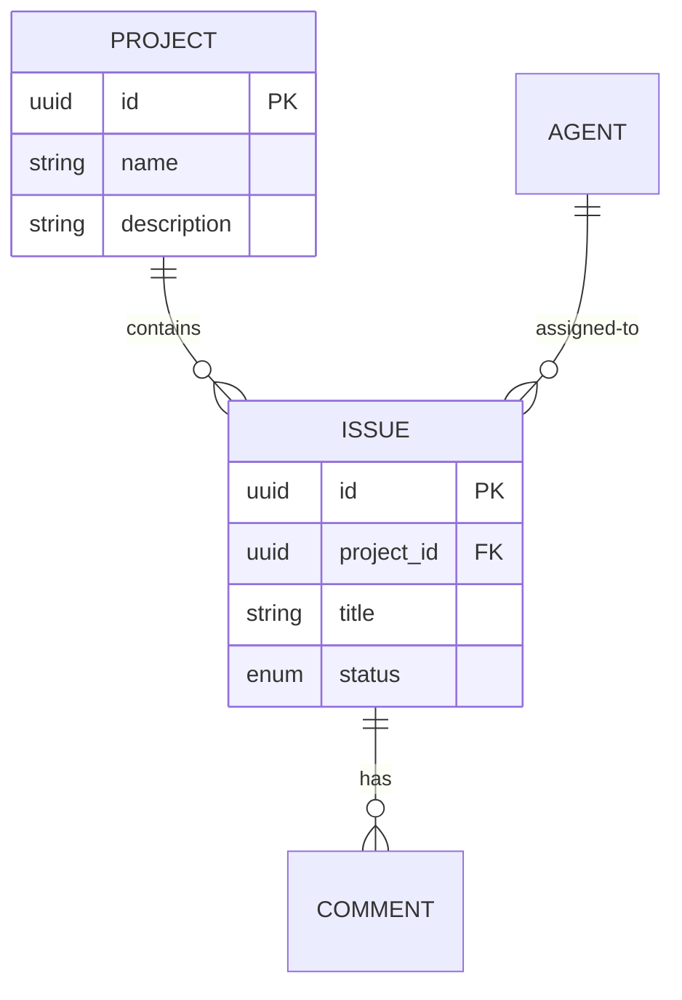
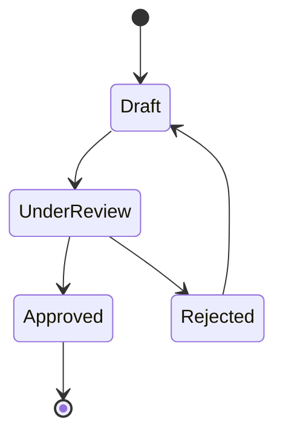

# Domain Model

**This template includes YAML frontmatter for validation and automation.**

The frontmatter above contains structured data that:
- ✅ Validates against JSON schema
- ✅ Defines ubiquitous language systematically
- ✅ Documents entities, events, and bounded contexts
- ✅ Provides audit trail

Keep the markdown body below for human narrative, diagrams, and detailed analysis.

---

## Ubiquitous Language (Glossary)

**Purpose:** Establish shared vocabulary between technical and business stakeholders.

| Term | Definition | Synonyms to Avoid | Context |
|------|------------|-------------------|---------|
| [Term 1] | [Clear definition] | [Ambiguous terms] | [Where used] |
| [Term 2] | [Clear definition] | [Ambiguous terms] | [Where used] |

**Example:**
| Term | Definition | Synonyms to Avoid | Context |
|------|------------|-------------------|---------|
| Issue | A trackable work item in GitHub | Task, Ticket, Bug (unless specifically a bug) | Project management context |
| Agent | AI coding assistant (Claude, Copilot, etc.) | Bot, Assistant (too generic) | Assignment and delegation |

---

## Core Entities

### Entity: [Entity Name]

**Definition:** [What this represents in the domain]

**Attributes:**
- `id`: [Type] - [Description]
- `name`: [Type] - [Description]
- `status`: [Enum: values] - [Description]

**Lifecycle:**
[States this entity moves through]
```
Created → Active → [Intermediate states] → Archived/Deleted
```

**Business Rules:**
1. [Rule 1]: [Condition → Action]
2. [Rule 2]: [Invariant that must hold]

**Related Entities:**
- [Relation type] to [Entity]: [Cardinality]

---

## Core Events

**Domain events** represent things that have happened that domain experts care about.

### Event: [EventName]

**When it occurs:** [Trigger condition]

**Payload:**
```json
{
  "eventId": "uuid",
  "timestamp": "ISO8601",
  "entityId": "uuid",
  "changes": {...}
}
```

**Consequences:**
- [What happens as a result]
- [Who/what listens to this event]

---

## System Boundaries

### Bounded Contexts

**Context 1: [Name]**
- **Responsibility:** [What this context owns]
- **Core entities:** [List]
- **Integration points:** [How other contexts interact]

**Context 2: [Name]**
- **Responsibility:** [What this context owns]
- **Core entities:** [List]
- **Integration points:** [How other contexts interact]

### Context Map

```
[Context A] --[Relationship]--> [Context B]
```

**Relationship types:**
- **Shared Kernel:** [If contexts share code/data]
- **Customer-Supplier:** [If one context depends on other]
- **Anti-Corruption Layer:** [If translation needed]

---

## Data Flow (Optional)

**High-level data movement through the system:**

```
[External Source] → [Input Boundary] → [Processing] → [Storage] → [Output Boundary] → [Consumer]
```

**Critical paths:**
1. [User action] → [System response] (latency: [target])
2. [Integration] → [Data sync] (frequency: [schedule])

---

## Diagrams (Optional)

### Entity Relationship Diagram



### State Machine (if applicable)



---

## Business Rules & Invariants

**Invariants** are rules that must ALWAYS be true:

1. [Invariant 1]: [Every X must have exactly one Y]
2. [Invariant 2]: [Z cannot be deleted if it has active A]

**Validation Rules:**

| Rule | Validation | Error Message |
|------|------------|---------------|
| [Rule name] | [Condition] | [User-facing message] |

---

## Integration Points (External Systems)

| System | Purpose | Data Exchanged | Sync Type | Owner |
|--------|---------|----------------|-----------|-------|
| [GitHub] | [Issue tracking] | [Issues, PRs, comments] | [Bidirectional] | [External] |
| [System 2] | [Purpose] | [Data] | [Push/Pull/Both] | [Internal/External] |

---

## Domain Assumptions

[ASSUMPTION] List assumptions about the domain that affect the model:

1. [Assumption 1]: [e.g., "Users can only belong to one organization at a time"]
2. [Assumption 2]: [e.g., "Issues are never permanently deleted, only archived"]
